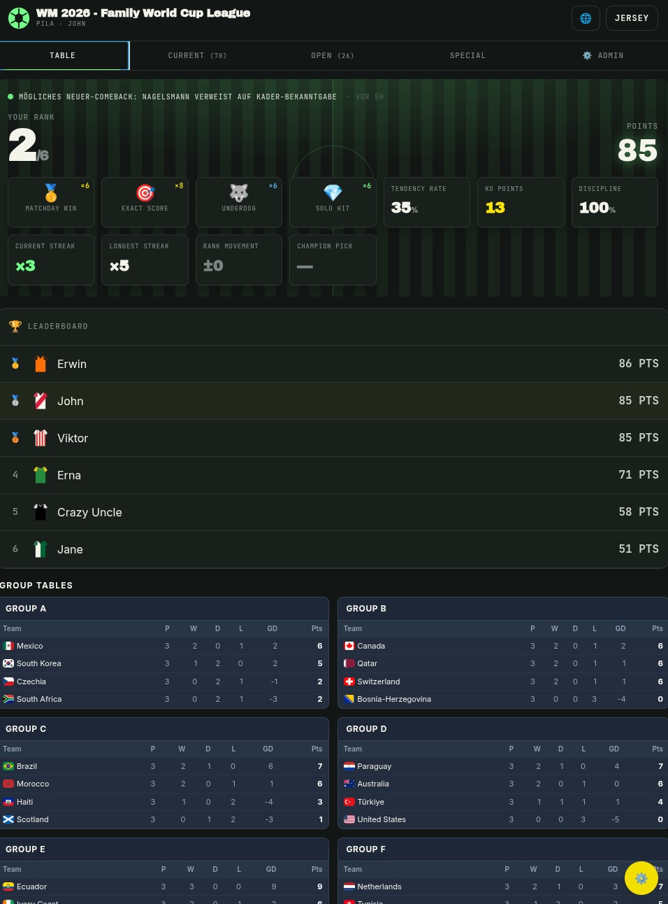
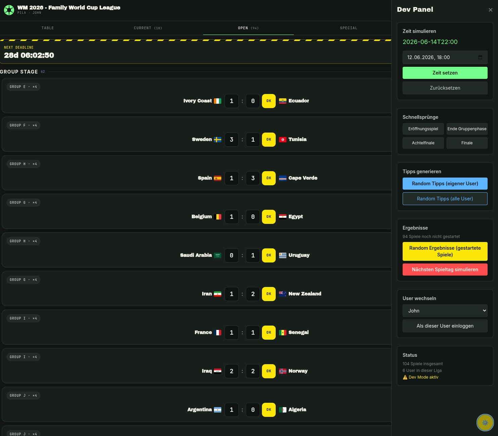

# Pila

[](https://github.com/JohannesKast/pila/actions/workflows/ci.yml)
[](https://codecov.io/gh/JohannesKast/pila)
[](https://www.gnu.org/licenses/agpl-3.0)
[](https://doc.rust-lang.org/edition-guide/rust-2024/index.html)

> **Pre-v0.1 — work in progress.** Core gameplay works; not every planned
> feature is implemented yet. If something is broken or missing, that is
> expected — contributions are very welcome.

*Pila* is Latin for **ball**.

A self-hostable FIFA World Cup 2026 prediction game (Tippspiel) written in Rust.
Players submit exact-score tips for every match plus a champion pick, collect
points, and watch the leaderboard move while gaining badges (not counted towards score ;-)). Built to run on a homelab box with
docker compose.

Pila is built around four principles:

1. **Simple for players.** No account registration, no password management, no
   app install. Each player gets one personal magic link — open it and you're
   in.
2. **Fair and distraction-free.** No ads, no growth mechanics, transparent
   scoring, clear match-lock behaviour. Strict league isolation so one league's
   data never touches another's.
3. **A page worth coming back to.** Badges, jersey presets, and an optional RSS
   news ticker keep the experience alive between kickoffs — without undermining
   the core game.
4. **Low effort for the host.** One small Docker Compose stack, automatic
   migrations, optional integrations. The person hosting it should be able to
   do something nice for their group without taking on much operator burden.

I started this project to learn more about agentic coding and to spend time
working with Rust and sqlx on a real, self-contained application instead of a
toy example.

## Screenshots

<p align="center">
  
  
</p>
<p align="center"><em>Left: App view · Right: Dev simulation mode</em></p>

---

## Current State & Known Gaps

Pila is **pre-v0.1**. The core game loop works end-to-end in local testing, but
several things are not yet production-verified:

- **Notifications (Signal & Email)** — the plumbing is there, but both
  transports are barely tested beyond the unit-test level. Real-world delivery
  (Signal account linking, SMTP edge cases, quiet-hours timing) has not been
  exercised in anger. Treat them as experimental and please report issues.
- I plan to use this for my friends and family group so I will constantly improve
  this project during the world cup season.

### Simulation mode

To try the app locally without waiting for real match results, enable dev mode:

```bash
PILA_DEV_MODE=true cargo run
# — or add PILA_DEV_MODE=true to your .env for the compose stack
```

Dev mode mounts a set of additional routes (only active when
`PILA_DEV_MODE=true`; 404 everywhere else) that let you:

- **Jump mock time** forward so pre-match deadlines pass and tip inputs lock.
- **Simulate a matchday** in one click: randomises results for the next batch
  of matches and advances time past their kickoffs.
- **Generate random tips** for all users at once — useful for testing the
  leaderboard and badge logic without clicking through every form.
- **Switch between users** without needing separate browser sessions.

This makes it straightforward to walk through an entire tournament — group
stage, knockouts, final — in minutes on a laptop.

---

## Features

- **Per-match score tipping** for the entire tournament (group stage through
  final) plus a single champion pick.
- **Points-based scoring** with a fixed table per tournament phase. Default
  (exact-score) mode: exact result / correct goal difference / correct tendency
  / wrong → 4-3-2-0 (group), 6-4-3-0 (R32/R16), 8-6-5-0 (QF/SF),
  11-8-6-0 (3rd place/final). Each league can optionally switch to a simpler
  winner-only mode (tip home win, draw, or away win) worth 1–7 points depending
  on the round.
- **Multi-tenancy**: run several isolated leagues on one instance, each with
  its own users, leaderboard, notification channel, and default language.
- **No accounts, no passwords**: each user gets a personal link. Open it and
  you're in — treat it like a password and share it privately.
- **Notifications** (optional, experimental): remind the group when a match or
  the champion pick is about to lock — via Signal group message and/or email.
- **Internationalised UI** in English, Spanish, French, and German.
- **Live score sync** via ESPN's scoreboard, polled every 30 minutes.
- **Badges** — purely cosmetic gamification, computed on the fly.
- **RSS news ticker** (optional) for a feed of your choice on the index page.
- **Hardened container by default**: read-only root FS, all capabilities
  dropped, CPU/memory/PID limits, healthchecks.

## Tech Stack

Axum + sqlx (PostgreSQL 15) + Askama templates + HTMX, served from a single
binary. Signal notifications go through `bbernhard/signal-cli-rest-api`.

## Requirements

- Linux host with Docker and Docker Compose v2
- A public hostname + reverse proxy if you want to expose the app to the
  internet (recommended: Caddy, Traefik, or nginx with Let's Encrypt)
- Optional: a dedicated Signal phone number for the bot
- Optional: an email account for outgoing notifications

## Installation

The shortest path is to run the published container image. If you are trying
this before the first release tag has been published, use the source-build
fallback below.

```bash
mkdir pila
cd pila
curl -fsSLO https://raw.githubusercontent.com/JohannesKast/pila/master/docker-compose.yml
curl -fsSLo .env https://raw.githubusercontent.com/JohannesKast/pila/master/.env.example
$EDITOR .env          # set POSTGRES_PASSWORD and BASE_URL at minimum
docker compose up -d
docker compose logs -f app
```

By default `.env.example` tracks `ghcr.io/johanneskast/pila:latest`. To pin a
specific release, set `PILA_IMAGE=ghcr.io/johanneskast/pila:v0.1.0` in `.env`
before starting. To update later, run `docker compose pull && docker compose up
-d`.

The app listens on `http://localhost:8000`. Migrations run automatically on
startup. On first start the admin setup page walks you through creating the
first league and your personal invite link.

### Build from source

If you want to test local changes or no release image exists yet:

```bash
git clone https://github.com/JohannesKast/pila.git
cd pila
cp .env.example .env
$EDITOR .env          # set POSTGRES_PASSWORD and BASE_URL at minimum
docker build -t pila:local .
PILA_IMAGE=pila:local docker compose up -d
docker compose logs -f app
```

### Notifications (optional, experimental)

> **Note:** Both notification transports are under-tested. If you run into
> problems, please open an issue — this is one of the areas most in need of
> real-world feedback.

**Signal**: set `SIGNAL_FROM_NUMBER` and `SIGNAL_GROUP_ID` in `.env`, then link
a dedicated phone number to the bundled `signal-cli` container:

```bash
# Full guide: https://github.com/bbernhard/signal-cli-rest-api
# Temporarily uncomment the signal-cli ports: line in docker-compose.yml,
# restart, register your number, then comment the port back out.
```

**Email**: set `SMTP_HOST`, `SMTP_PORT`, `SMTP_USER`, `SMTP_PASS`, and
`SMTP_FROM` in `.env`. Any standard provider works (Gmail app password,
Fastmail, a homelab MTA). If the vars are absent, email delivery is skipped and
invite links are shown in the admin UI for manual sharing.

## Secure Deployment

### Reverse proxy with TLS

Do **not** expose port 8000 directly. Example Caddy snippet:

```caddyfile
pila.example.com {
    encode zstd gzip
    reverse_proxy pila_app:8000
    header {
        Strict-Transport-Security "max-age=31536000; includeSubDomains; preload"
        X-Content-Type-Options "nosniff"
        Referrer-Policy "strict-origin-when-cross-origin"
        Permissions-Policy "interest-cohort=()"
    }
}
```

Set `BASE_URL=https://pila.example.com` in `.env` so invite links and
notifications use the public hostname.

### Secrets & access control

- Generate `POSTGRES_PASSWORD` with `openssl rand -base64 32`; store `.env`
  with `chmod 600`.
- Keep `.env` out of git (already in `.gitignore`).
- Invite links are bearer credentials — share them via Signal, a password
  manager, or another private channel.
- Do **not** expose the `signal-cli` port in production — it has no auth. The
  comment in `docker-compose.yml` is for the one-time registration step only.

### Container hardening

The default `docker-compose.yml` already drops all Linux capabilities, sets
`no-new-privileges`, mounts the root FS read-only, and limits CPU/memory/PIDs.
Don't relax those without a reason.

### Backups

```bash
./backup_db.sh                  # gzip dump into ./backups/
./restore_db.sh backups/<file>  # restore
```

Schedule `backup_db.sh` via cron or a systemd timer. The database is the only
stateful piece worth backing up.

### Updates

```bash
git pull
docker compose build app
docker compose up -d app
```

Migrations run automatically on startup.

## Local Development

```bash
docker compose up -d db
cp .env.example .env  # set POSTGRES_PASSWORD
DATABASE_URL=postgres://pila:<pw>@localhost:6433/pila_db cargo run
```

```bash
cargo test       # unit + integration tests
cargo clippy
cargo sqlx prepare   # after any sqlx::query! change — commit .sqlx/
```

Enable `PILA_DEV_MODE=true` to play through the tournament locally without real
match data (see [Simulation mode](#simulation-mode) above).

See [`doc/architecture.md`](doc/architecture.md) for the full architecture
overview, [`doc/release.md`](doc/release.md) for the GitHub release flow,
and [`CONTRIBUTING.md`](CONTRIBUTING.md) for the contributor workflow.

## Contributing

Contributions are very welcome. The project is young and there is plenty to do —
especially:

- **Battle-testing notifications** (Signal and email delivery in real setups)
- **UI feedback** — Askama/HTMX templates, no JavaScript framework required
- **i18n improvements** — four locale files (`locales/{en,es,fr,de}.ftl`);
  better translations or new languages are straightforward to add
- **Bug reports** from anyone running the app against real tournament data

See [`CONTRIBUTING.md`](CONTRIBUTING.md) for setup instructions and mandatory
PR gates. Issues and PRs are open to everyone.

## Roadmap

### Planned for v0.1

- Pre-built Docker image on GHCR (no build step for end users)
- Verified notification delivery (Signal + email) in a real homelab setup
- Configurable quiet hours (currently hardcoded to `Europe/Berlin`)

### Post-v0.1 ideas

- Per-user notification preferences (opt-out of reminders)
- Per-league notification language (currently fixed at league default)
- Optional public leaderboard link (read-only, no login required)
- mdBook documentation site

### Intentionally out of scope

- Mobile apps — the web UI is responsive
- Social features (comments, chat)
- Commercial hosting or SaaS
- Betting-money mechanics — this is a points game

---

## License

[GNU Affero General Public License v3.0 or later](LICENSE).

Pila is free software: you can redistribute it and/or modify it under the terms
of the AGPL-3.0-or-later. If you run a modified version on a network server,
you must offer its source code to the users interacting with it. See the LICENSE
file for the full text.
